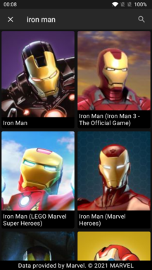
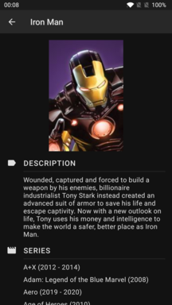

 [](https://codecov.io/gh/inorichi/android-playground)

# Android playground

This is a sample Android application with a strong focus on a clean architecture, automated unit and UI testing and continuous integration.

The application shows a list of Marvel characters using the [Marvel API](https://developer.marvel.com/) with the option to search for characters, and a details page showing the selected character profile.

 

## Building the project

In order to build this project, an API key needs to be provided in the `local.properties` file using the following scheme:

```
api.ts={YOUR_API_TS}
api.key={YOUR_API_KEY}
api.hash={YOUR_API_HASH}
```

More details for getting an API key can be found [here.](https://developer.marvel.com/account)

## Architecture

The application architecture is built based on [Uncle Bob's Clean Architecture](https://blog.cleancoder.com/uncle-bob/2012/08/13/the-clean-architecture.html) to enforce a proper separation of concerns, limiting boundaries and unidirectional data flow. For this reason, the project has been divided into 4 modules:

* `domain`: It contains the entities, repositories interfaces and use cases (interactors) of the application. This module's dependencies are as small as possible, and should never depend on any networking or persistency library.

* `data`: It contains the networking and persistency libraries as well as the repository implementations of the `domain` layer through dependency injection.

* `presentation`: It contains the UI and view models (using MVVM) of the application. The view models receive in their constructor the `domain` use cases for fetching or updating the data. Note this module does not add a dependency on the `data` module.

* `app`: It's the top-most module, its only job is to bring together the other modules and provide the Android's `Application` and `Activity` classes.

## Libraries

* [Coroutines](https://github.com/Kotlin/kotlinx.coroutines) for background work and observer pattern with `Flow`.

* [OkHttp](https://github.com/square/okhttp) and [Retrofit](https://github.com/square/retrofit) for networking.

* [Kotlin Serialization](https://github.com/Kotlin/kotlinx.serialization) for JSON parsing.

* [Hilt](https://developer.android.com/training/dependency-injection/hilt-android) for dependency injection. This was preferred over other pure Kotlin libraries because Hilt/Dagger has support for javax `@Inject` annotations which alongside the Dagger KAPT processor can create our dependencies factories, saving us from writing this boilerplate code. This is especially useful for view models that need several use cases.

* [Room](https://developer.android.com/training/data-storage/room) for database persistency.

* [View Model](https://developer.android.com/topic/libraries/architecture/viewmodel) for writing our view models.

* [Jetpack Compose](https://developer.android.com/jetpack/compose) for building the UI.

* [Jetpack Compose Navigation](https://developer.android.com/jetpack/compose/navigation) for UI navigation.

* [Accompanist](https://github.com/google/accompanist) for system bars tinting and animated navigation.

* [Paging](https://developer.android.com/topic/libraries/architecture/paging/v3-overview) for paginated listings.

* [Coil](https://github.com/coil-kt/coil) for image loading.

* [Kotest](https://github.com/kotest/kotest) for writing the unit tests.

* [MockK](https://github.com/mockk/mockk) for mocking dependencies on our tests.

* [Robolectric](http://robolectric.org/) for running unit tests that require an Android context.

* [Jetpack Compose Test](https://developer.android.com/jetpack/compose/testing) for UI testing.

* [JaCoCo](https://www.eclemma.org/jacoco/) for code coverage reports.

## How it works

When the application is started, our Compose app will create a `Navigation` which pushes the `CharacterListScreen` on top of the navigation graph. The listing screen then calls the `hiltViewModel<CharacterListViewModel>()` function on its constructor and Dagger/Hilt will create an instance of our view model with the dependencies we have declared on its primary constructor (it must be annotated with `@Inject`). If Dagger/Hilt can't create any of its dependencies, it will throw a compile time error rather than a runtime error due to its compile-time validation graph. The injection will happen recursively, this means we're going to have our repositories and data sources ready for work.

Now that `CharacterListViewModel` is instantiated, we can start requesting data to the `GetCharactersPaginated` use case by invoking it with a query parameter (`null` by default, which means list all characters) and this will return us an instance of a `PagingSource` to request data page by page. Every time a page is requested, it calls the method `getCharacters` of our `CharacterRepository` interface with the current page and query. Since Dagger has injected the dependency, we will actually be using the `CharacterRepositoryImpl` of our data module (to which the ViewModel does not have direct access thanks to the multi-module approach), and this repository will delegate the remote fetching to the `CharacterRemoteDataSource` that also delegates on a `MarvelApi` Retrofit instance (also injected) and this is where our request is actually made. When the data is available, it returns it to the `CharacterRemoteDataSource` where the response is mapped to an entity of our domain (called `CharacterOverview`) and our `CharacterLocalDataSource` saves the result on the `Room` database. Finally, the result is returned to the use case and then to the `PagingSource`.

Since we developed the UI using Jetpack Compose, we have a reactive UI that is updated automatically whenever there's a new update to the `PagingSource` thanks to the `.collectAsLazyPagingItems()` function. While this request was being processed, we had a loading state in the screen, but now that our first page has arrived, we can start rendering the first page on the screen.

We also account for any possible error (use cases MUST always handle any possible error thrown from the backend and return a custom `Result` class if needed), like a request failed due to network unavailable. In this case, an error page is shown, where we can retry our request. The UI will then go back to the loading state and finally the content state when available. Thanks to the Paging library, we will also request the following pages as the list is scrolled down.

The user is also presented a search icon in the toolbar in case he wants to query a specific character, and when he taps the enter button of the keyboard, the ViewModel restarts the `PagingSource` by calling again our use case with the provided query, then the `CharacterListViewState` is updated and the whole process starts over.

When a result of the list is tapped, `Navigation` handles our intent and pushes the `CharacterDetailsScreen` on top of the listing screen. Then, similar as before, a `CharacterDetailsViewModel` is instantiated with its declared the dependencies (a `SavedStateHandle` for retrieving the character id and the `GetCharacter` use case) and the screen renders a loading state while our data is retrieved. Our use case then calls the method `getCharacter` of our repository with the selected character id, and then the method `getCharacterDetails` on our `CharacterRemoteDataSource` which then makes the network request through our `MarvelApi` Retrofit instance. Once the data is ready, it's mapped to our entity `CharacterDetails` and returned to the repository, which also saves the data locally (as a plus, if this request fails, it tries to fetch the data locally, so if we have it cached, we return that data, otherwise the error is rethrown) and returns it to the use case, where we return a custom `Result` object handling every possible situation (either `Success`, `NotFound` or `Error` result). This result is finally returned to the ViewModel, which pushes a new `CharacterDetailsViewState` and forces a UI recomposition to reflect the new state.

## Continuous Integration

The application automatically runs unit tests and UI tests on every commit thanks to Github CI and code coverage reports are pushed to [CodeCov](https://app.codecov.io/gh/inorichi/android-playground).
